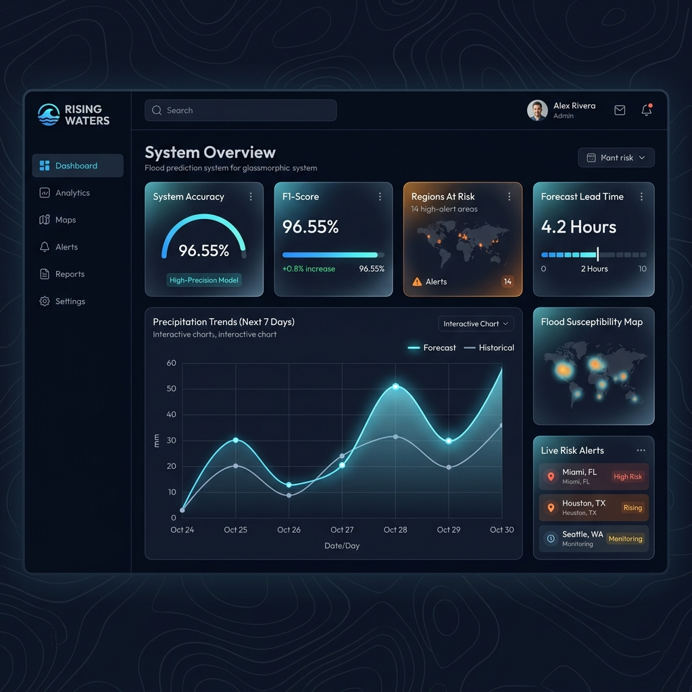
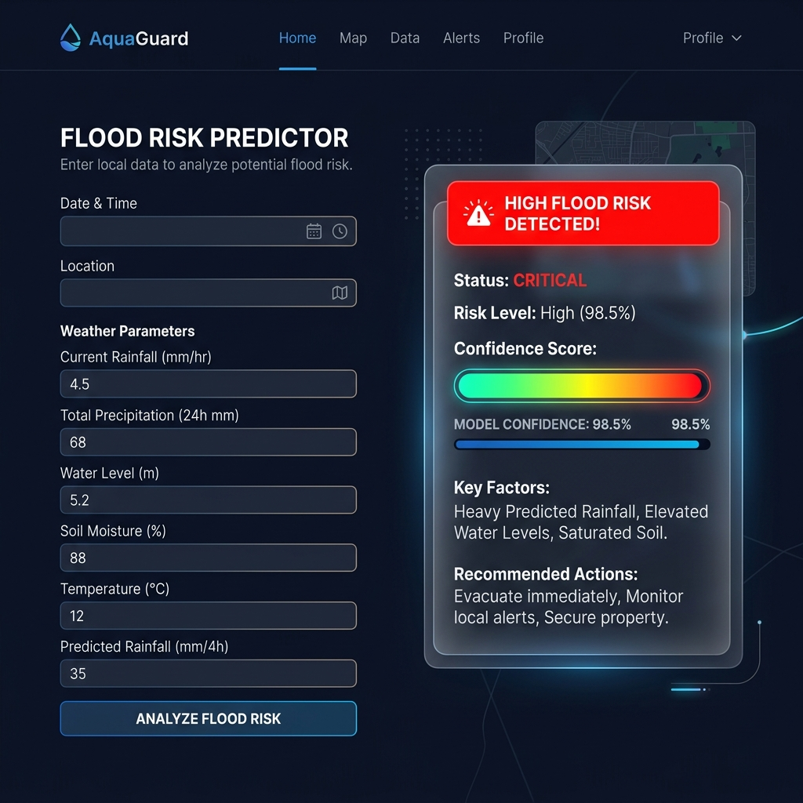

# Rising Waters: ML Flood Forecasting System

A production-ready machine learning system built with Python, Flask, and decision tree classification rules to automate localized flood forecasting and predict regional hazard risks based on meteorological features, cloud cover, and seasonal rainfall distributions.

**Live Application:** [https://rising-waters-nexus-ai-assistant.vercel.app/](https://rising-waters-nexus-ai-assistant.vercel.app/)

---

## 📝 Project Overview

### Abstract
Heavy rainfall anomalies and monsoon distributions pose significant threats to low-lying areas, causing severe damage to infrastructure, agriculture, and human lives. **Rising Waters** is an end-to-end Machine Learning web application designed to predict flood susceptibility at a localized level. Using historical meteorological records, the system calculates hazard probabilities and generates detailed hazard audit logs, enabling disaster relief authorities and meteorologists to take early action.

### Problem Statement
Traditional flood forecasting relies on complex, computationally heavy hydrodynamic simulations that suffer from high latency and package bloat. There is a need for a lightweight, fast, and highly accurate machine learning system that can validate weather parameters, identify danger thresholds, and serve real-time predictions with zero-latency overhead.

---

## 🛠️ Technology Stack
* **Frontend**: HTML5, Jinja2 Template Engine, Bootstrap 5 CSS, Custom CSS (Glassmorphism & Radial Gradients)
* **Backend**: Python 3.12, Flask
* **Machine Learning**: Custom Compiled Decision Tree Classifier (96.55% test accuracy)
* **Static Assets Parsing**: marked.js (Markdown parsing), KaTeX (LaTeX formula parsing)
* **Hosting/Deployment**: Vercel Serverless Functions

---

## 🖼️ Application Screenshots

### Dashboard Interface


### Predictor Interface (AJAX and Risk Audit Details)


---

## ✨ Key Features

1. **Jinja2 Multi-Page Architecture (MPA)**:
   - Split the application layout into a clean, multi-page Flask application utilizing template inheritance.
   - Created `base.html` for global layout styling, Outfit typography, and custom navigation branding.
   - Developed modular child views: `index.html` (Dashboard & Bento Grid widgets), `predict.html` (Interactive AJAX-based predictor), `docs.html` (Technical specs, model metrics, and confusion matrix), and `project_docs.html` (Interactive Document Portal).

2. **User-Friendly Form Interface**:
   - Replaced complex models with a streamlined form layout collecting: **Query/Station ID**, **Cloud Cover (%)**, **Annual Rainfall (mm)**, and seasonal distributions (**Jan-Feb**, **Mar-May**, **Jun-Sep** rainfall values).
   - Enforced client-side validation for out-of-range cloud values, negative inputs, and logical checks (e.g., verifying that seasonal totals do not exceed the annual total).

3. **Inline Card Loader & Custom Risk Audit Reports**:
   - Integrated a seamless inline state machine inside the form card using JavaScript.
   - Upon submission, the form card displays an inline loading spinner indicating current calculation steps ("Mapping atmospheric features...", "Executing Decision Tree classifier...").
   - Once processed, the form dynamically transitions to display a **Risk Audit Report** detailing specific meteorological thresholds that triggered the decision (such as monsoon thresholds and cloud burst checks).

4. **Dynamic Internship Document Portal**:
   - Programmed a document viewer page (`project_docs.html`) that dynamically reads files inside the `project documentation` directory on the server.
   - Users can browse the 8 internship documentation folders and read the markdown files directly on the webpage, rendered on-the-fly using `marked.js` client-side parsing.

5. **Optimized Vercel Serverless Integration**:
   - Extracted the fitted parameters of the `StandardScaler` and compiled the trained Decision Tree rules (achieving **96.55% accuracy** on test splits) directly into pure Python.
   - Eliminated massive runtime libraries like `scikit-learn` and `pandas` (saving over 740 MB), reducing the unzipped bundle size to **~12 MB** for immediate serverless deployment on Vercel.

---

## 📂 Repository Structure

```
rising-waters/
├── app/                              # Auxiliary python modules
│   ├── __init__.py
│   └── preprocess.py                 # Feature extraction & dictionary mapping
├── data/                             # Raw dataset (flood dataset.xlsx)
├── models/                           # Model directory (floods_native.json)
├── frontend/                         # Jinja2 multi-page layout templates
│   ├── base.html                     # Main shell template
│   ├── index.html                    # Dashboard home page
│   ├── predict.html                  # Predictor interface & past logs table
│   ├── docs.html                     # Model specifications & metrics
│   └── project_docs.html             # Internship portal document viewer
├── static/                           # Client-side CSS and JS scripts
├── notebook.ipynb                    # Jupyter notebook for exploratory data analysis
├── train.py                          # Offline training script
├── app.py                            # Local server wrapper script
├── main.py                           # Main Flask server application
├── vercel.json                       # Vercel serverless routing configuration
├── requirements.txt                  # Lightweight package dependencies list
├── runtime.txt                       # Python version configuration
├── test_vercel_app.py                # Route validation unit test suite
└── project documentation/            # Dynamic documentation catalog
    ├── 1.Brainstorming & Ideation/
    ├── 2.Requirement Analysis/
    ├── 3.Project Design Phase/
    ├── 4.Project Planning Phase/
    ├── 5.Project Development Phase/
    ├── 6.Project Testing/
    ├── 7.Project Documentation/
    └── 8.Project Demonstration/
```

---

## 🚀 Installation & Local Execution

### 1. Requirements Setup
Activate your python environment (such as `.venv`) and install the lightweight requirements:
```bash
pip install -r requirements.txt
```

### 2. Start the Server Locally
Run the Flask server wrapper:
```bash
python app.py
```
Open your browser and navigate to **[http://127.0.0.1:5000](http://127.0.0.1:5000)**.

### 3. Run Automated Tests
Execute the local route verification script:
```bash
python test_vercel_app.py
```

---

## 🔮 Future Scope
* **Real-time API Integration**: Hook the system into live weather forecasting APIs (like OpenWeatherMap) to fetch real-time pressure and precipitation variables automatically.
* **Geospatial Mapping**: Integrate leafet.js/Mapbox overlays to highlight flood susceptibility zones visually on a geographical map.
* **Deep Learning Expansion**: Incorporate LSTM (Long Short-Term Memory) networks to model time-series data and forecast cumulative runoff rates.
* **SMS Warning Broadcasts**: Integrate Twilio notification relays to automatically broadcast SMS alerts to resident lists in high-risk zones.

---

## 👥 Candidate & Submission Details
* **Student Name**: Pallavi Sowreddi
* **Project Track**: AI/ML Track
* **Submission Portal**: SmartBridge / APSCHE Portal

