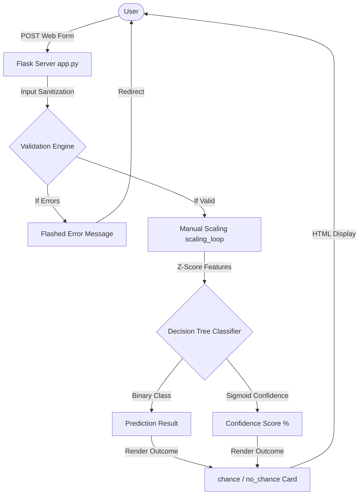

# Requirements Specification - Rising Waters

## 1. System Requirements

### Hardware Requirements
* **Processor**: Intel Core i3 or equivalent (minimum); Intel i5 or above (recommended for model training).
* **RAM**: 4 GB (minimum); 8 GB (recommended for running local notebooks and training pipelines).
* **Storage**: 2 GB free disk space (to house datasets, virtual environments, and source code).
* **Network**: Active internet connection for Vercel/GitHub deployment and initial library installations.

### Software Requirements
* **Operating System**: Windows 10/11, macOS, or Linux.
* **Development Environment**: VS Code or PyCharm.
* **Python Runtime**: Python 3.8 to 3.12.
* **Web Framework**: Flask (WSGI web micro-framework).
* **Web Libraries**: Bootstrap 5, Bootstrap Icons, FontAwesome.
* **ML Libraries (Local Development)**: Scikit-learn, XGBoost, Pandas, Numpy, Openpyxl.

---

## 2. Data Flow Diagrams (DFD)

### Level 0 DFD: Context Diagram

### Level 1 DFD: System Architecture

