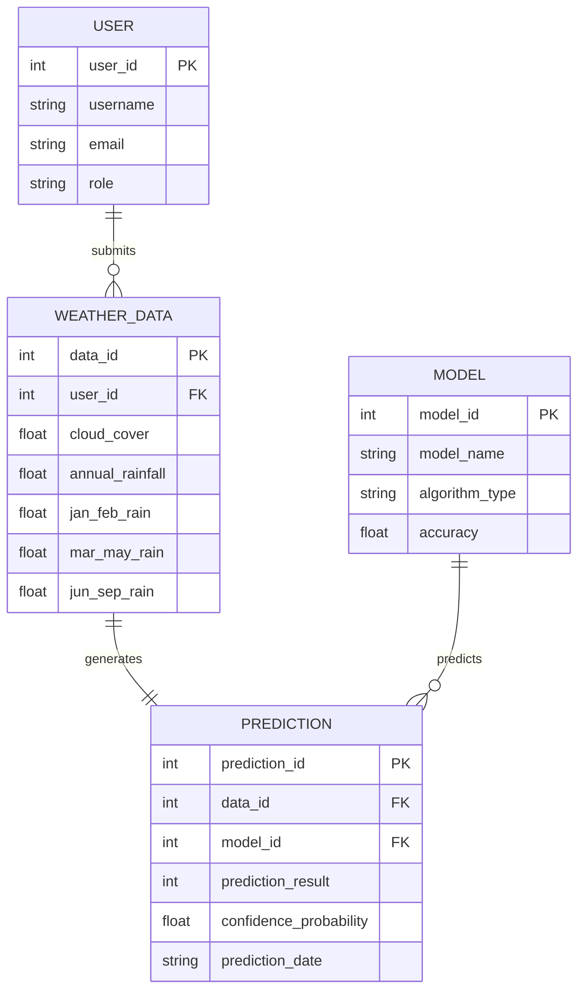

# Project Design Document - Rising Waters

## 1. Entity Relationship (ER) Diagram
This diagram represents the entities involved in the Rising Waters tracking and predictions framework:

---

## 2. Solution Architecture

The solution uses a standard Model-View-Controller (MVC) serverless design:

1. **User Interface (View)**: 
   - Renders interactive Bootstrap 5 CSS layouts on the browser.
   - Collects variables using standard floating label components.
   - Restricts invalid forms using Javascript validations before hitting the server.
2. **Web Server Backend (Controller)**:
   - Built with Flask (Python).
   - Validates ranges, checks logical rain distribution rules, and flashes validation errors.
   - Normalizes feature sets using pre-calculated training metrics.
   - Redirects routing paths dynamically based on prediction outputs.
3. **Machine Learning Model (Model)**:
   - Standard Supervised Decision Tree Classifier rules compiled directly into a Python function.
   - Computes logistic probability curves to provide prediction confidence percentages without loading heavy dependencies.
4. **Cloud Infrastructure**:
   - Hosted on Vercel utilizing Serverless Python Functions, allowing the application to scale dynamically under load.
