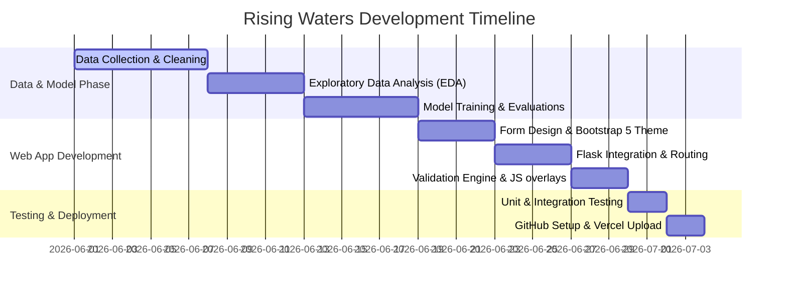

# Project Planning Sheet - Rising Waters

## 1. Project Milestone Schedule

---

## 2. Activity Breakdown

1. **Sprint 1: Data Preparation**
   - Import meteorology records.
   - Clean empty values and capping outliers using Interquartile Range (IQR).
   - Visualize data correlations with heatmaps in Jupyter Notebook.
2. **Sprint 2: Model Engineering & Scaling**
   - Partition data into 75% training and 25% testing.
   - Evaluate Decision Tree, Random Forest, KNN, and XGBoost classifiers.
   - Optimize the scaler and export parameters.
3. **Sprint 3: Web Server Implementation**
   - Create Flask app structure with `/Predict`, `/chance`, `/no_chance` routes.
   - Structure templates with Bootstrap 5.
   - Set up client-side form validations.
4. **Sprint 4: Verification & Cloud Launch**
   - Run local unit tests verifying redirects and validators.
   - Refactor codebase to fit Vercel bundle restrictions.
   - Initialize git, commit changes, and launch on Vercel.
